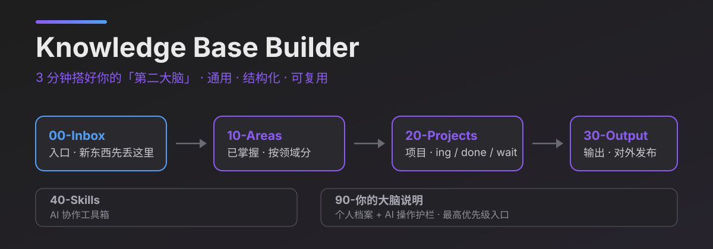
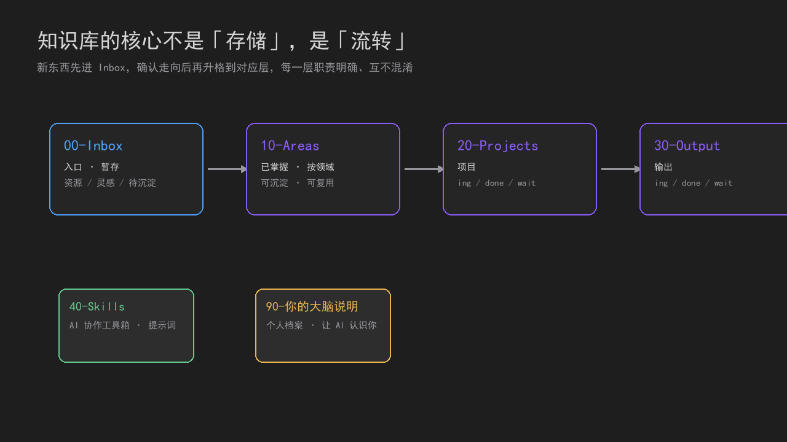
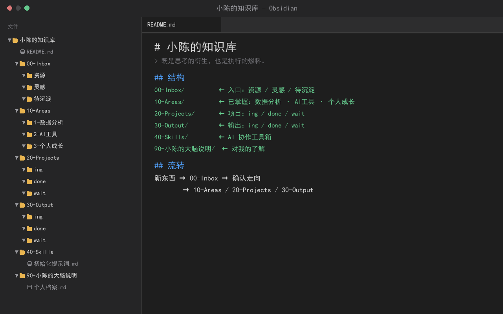

<p align="center">
  
</p>

<p align="center">
  
  
  
  
</p>

**English**: README.en.md · **中文**: [README.md](./README.md)

Knowledge Base Builder is an agent-agnostic Skill that guides you to scaffold a structured "second brain" knowledge base in about 3 minutes. Any agent with "read/write files + ask questions" capabilities can run it.

You don't need any knowledge-management theory. Say "help me build a knowledge base", answer a few questions, and it generates a structure deterministically with a script — no missing folders, no duplicates, sensible defaults when you don't have an answer yet.

## What the result looks like

**Knowledge flow** (the core is flow, not storage):



**Generated knowledge base structure** (opened in Obsidian):



```text
00-Inbox/         entry: dump new things here
10-Areas/         digested knowledge, by domain
20-Projects/      projects: ing / done / wait
30-Output/        output: ing / done / wait
40-Skills/        AI collaboration tools
90-your-brain/    personal profile so the agent knows you
```

**Core flow**: new things → 00-Inbox → confirm direction → 10-Areas / 20-Projects / 30-Output

The brain folder (`90-your-brain/`) comes with 6 files at once: `README` (manual), `个人档案` (your profile), `agents` (operating constraints), `初始化提示词` (a full reset prompt covering the digestion workflow, promotion criteria, and gates), `文件追踪` (link auto-fix on file moves), and `备份方案` (backup plan). The agent reads this first.

## Features

- ✅ **Universal**: the core flow only needs "read/write files + ask questions", no host-specific features
- ✅ **Robust**: defaults for incomplete info, step-by-step execution, retryable on error
- ✅ **Stable**: the skeleton is generated deterministically by a script and refuses to overwrite existing structures
- ✅ **Structured**: Inbox → Areas → Projects → Output four-layer flow

## Install

Tell your agent:

```text
Install this Skill: https://github.com/ivercurry99/knowledge-base-builder
```

Or use the command:

```shell
npx skills add ivercurry99/knowledge-base-builder
```

## Usage

After installing, say:

```text
help me build a knowledge base
```

Then follow the guided questions. See [`examples/数据分析师示例.md`](examples/数据分析师示例.md) for what a "data analyst" knowledge base looks like when built with this Skill.

## Data & boundaries

- All files are generated **locally**; nothing is uploaded or sent over the network.
- **No configuration, no credentials** required.
- If the target directory already has a knowledge base structure, it will **not overwrite** it — it asks whether to extend or rebuild first.
- Overwriting, deleting, or rebuilding requires your confirmation.

## Compatibility

| Scope | Status |
|-------|--------|
| Core flow | Only needs "read/write files + ask questions"; any capable agent can run it |
| Skeleton script | Python 3.10+, standard library only, cross-platform macOS / Windows / Linux |
| No Python available | Supported: create the same structure manually per `references/file-templates.md` |
| Network | Not required |

## Design

The core of a knowledge base is "flow", not "storage":

- Drop things into Inbox first, unclassified
- Promote digested knowledge into Areas for reuse
- Projects go into Projects, published work goes into Output
- Each layer has a clear role and they don't mix

The layering is inspired by Tiago Forte's PARA method (Projects / Areas / Resources / Archives) and the "second brain" idea; this project adapts the layers and flow rules independently and is not affiliated with Forte Labs.

## Development

```shell
# regression tests for the scaffold script
python -m unittest discover -s tests -v
```

## License

[MIT](./LICENSE)
